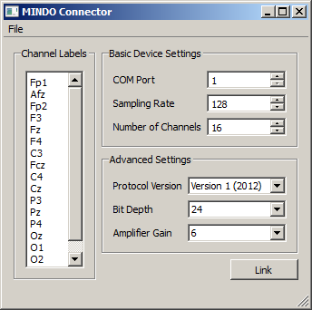
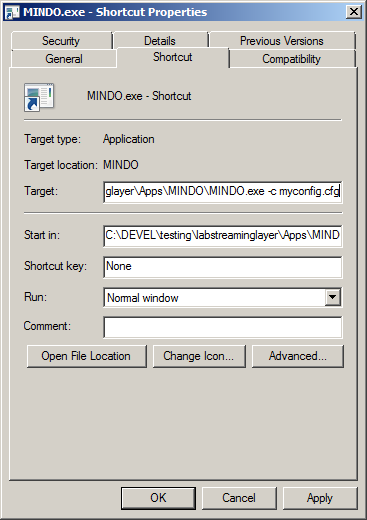

== Usage ==

he program should support the current generation of dry/wireless EEG systems by MINDO (http://mindo.com.tw) that use the Bluetooth serial port profile.

To use this program, you first need to have your MINDO EEG system paired to your computer via Bluetooth. The pairing code for the device is 0000. 

(Side note: If necessary, please consult your operating system documentation on how to pair a device with your computer (on Windows, it essentially amounts to right-clicking the Bluetooth icon in the systray, selecting "Add Device...", picking the MINDO or "SPP Slave" device, selecting the "pair with a pairing code" option, typing in 0000, and waiting until the device is successfully added. As the device is getting paired, it is being assigned a COM port (a.k.a. serial port) number by your OS. On Windows, you see the assigned port number as a pop-up notification in your taskbar (saying something along the lines of "COM3" or some other number). You can also look it up in the device properties after it has been added.)

Start the MINDO app. You should see a window like the following.
>

Make sure that you have the right COM port (you should see this in your Control Panel / System / Device Manager / Ports / COMx system setting), the correct number of channels, and a supported sampling rate set up (the default should be fine). The number of channels in the channels list must match the numeric value (but you can use dummy names for a quick test). If you are unsure about the protocol version, you most likely have Version 1 (the default). The bit depth and gain can also be left at their defaults.

Click the "Link" button. If all goes well you should now have a stream on your lab network that has name "MINDO" and type "EEG". Note that you cannot close the app while it is linked.

== Optional ==

The configuration settings can be saved to a .cfg file (see File / Save Configuration) and subsequently loaded from such a file (via File / Load Configuration). Importantly, the program can be started with a command-line argument of the form "MINDO.exe -c myconfig.cfg", which allows to load the config automatically at start-up. The recommended procedure to use the app in production experiments is to make a shortcut on the experimenter's desktop which points to a previously saved configuration customized to the study being recorded to minimize the chance of operator error.
> 
